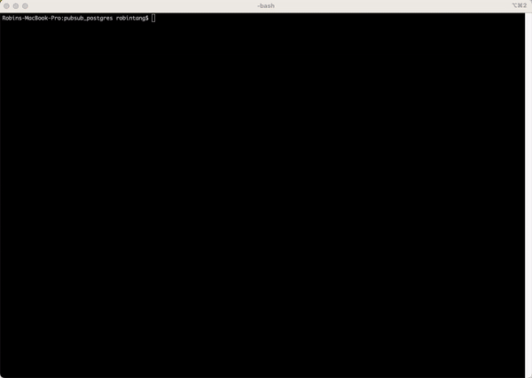

# Setting up Pub/Sub

## Overview

In this tutorial, we will learn how to run Debezium Server with Pub/Sub sink and Artie Transfer locally using Docker.

<figure><figcaption></figcaption></figure>

## Prerequisites

* Terraform
* Docker
* gcloud CLI
* GCP Project

### Set-up

**gcloud CLI**

Please visit [this link](https://cloud.google.com/sdk/docs/install) to download the CLI. Once you have done so, run this command:

```bash
gcloud auth application-default login
```

**Pub/Sub API**

To use Pub/Sub in your GCP project, you will also need to enable it. Visit [this link](https://console.cloud.google.com/marketplace/product/google/pubsub.googleapis.com) to enable it.

<figure><figcaption></figcaption></figure>

## Creating a service account

```hcl
locals {
  project = "PROJECT_ID"
  role = "roles/pubsub.editor"
}

provider "google" {
  project     = local.project
  // Authenticate via gcloud auth application-default login
  // This requires the gcloud CLI downloaded: https://cloud.google.com/sdk/docs/install
  // Need to enable PubSub API: https://console.cloud.google.com/marketplace/product/google/pubsub.googleapis.com
}

resource "google_service_account" "artie-svc-account" {
  account_id   = "artie-service-account"
  display_name = "Service Account for Artie Transfer and Debezium"
}

resource "google_project_iam_member" "transfer" {
  project = local.project
  role    = local.role
  member  = "serviceAccount:${google_service_account.artie-svc-account.email}"
}
```

<pre class="language-bash"><code class="lang-bash"><strong>$ terraform init # Install the necessary libraries.
</strong><strong>$ terraform plan
</strong>$ terraform apply
</code></pre>

## Download the service account credentials

Once your service account has been created, head to the GCP console and create a key for the service account. Save the key as we will be referencing it in the later steps.

<figure><figcaption></figcaption></figure>

## Create the Pub/Sub topic and subscriptions


Debezium will not automatically create topics or subscriptions for you.


```hcl
resource "google_pubsub_topic" "customer_topic" {
  name    = "dbserver1.inventory.customers"
  project = local.project

  timeouts {}
}

resource "google_pubsub_subscription" "customer_subscription" {
  ack_deadline_seconds         = 300
  enable_exactly_once_delivery = false
  enable_message_ordering      = true
  message_retention_duration   = "604800s"
  name                         = "transfer_${google_pubsub_topic.customer_topic.name}"
  project                      = local.project
  retain_acked_messages        = false
  topic                        = google_pubsub_topic.customer_topic.id

  timeouts {}
}
```

```
$ terraform plan
$ terraform apply
```

## Running Debezium

Within the pubsub examples folder, make sure to modify the [application.properties](https://github.com/artie-labs/transfer/blob/master/examples/pubsub\_postgres/application.properties) to specify the `project_id`. If you need help locating your GCP Project ID, see [#getting-your-project-identifier](../real-time-destinations/bigquery.md#getting-your-project-identifier "mention")

```properties
# Offset storage
debezium.source.offset.storage.file.filename=/tmp/foo
debezium.source.offset.flush.interval.ms=0

# Pubsub setup: https://debezium.io/documentation/reference/stable/operations/debezium-server.html#_google_cloud_pubsub
debezium.sink.type=pubsub
debezium.sink.pubsub.project.id=PROJECT_ID
debezium.sink.pubsub.ordering.enabled=true

# Postgres
debezium.source.connector.class=io.debezium.connector.postgresql.PostgresConnector
debezium.source.database.hostname=postgres
debezium.source.database.port=5432
debezium.source.database.user=postgres
debezium.source.database.password=postgres
debezium.source.database.dbname=postgres
debezium.source.topic.prefix=dbserver1
debezium.source.table.include.list=inventory.customers
debezium.source.plugin.name=pgoutput
```

## Running Transfer

Below is the [config.yaml](https://github.com/artie-labs/transfer/blob/master/examples/pubsub\_postgres/config.yaml) where the `test database` will just output the query commands into the terminal. Make sure to also fill out the `projectID`&#x20;

Visit [options.md](../running-transfer/options.md "mention") to see all the possible options for your configuration file and [examples.md](../running-transfer/examples.md "mention").

```yaml
outputSource: test
queue: pubsub

pubsub:
  projectID: artie-labs
  pathToCredentials: /tmp/credentials/service-account.json
  topicConfigs:
    - db: customers
      tableName: customers
      schema: public
      topic: "dbserver1.inventory.customers"
      cdcFormat: debezium.postgres.wal2json
      cdcKeyFormat: org.apache.kafka.connect.json.JsonConverter

telemetry:
  metrics:
    provider: datadog
    settings:
      tags:
       - env:production
      namespace: "transfer."
      addr: "127.0.0.1:8125"
```

## Docker Compose File

Now, within the [docker-compose.yaml](https://github.com/artie-labs/transfer/blob/master/examples/pubsub\_postgres/docker-compose.yaml) file, you will need to specify the path to your credentials that you have downloaded from the prior step. [#download-the-service-account-credentials](setting-up-pub-sub.md#download-the-service-account-credentials "mention").

```yaml
version: '3.9'
services:
  postgres:
    image: quay.io/debezium/example-postgres:2.0
    ports:
     - 5432:5432
    environment:
     - POSTGRES_USER=postgres
     - POSTGRES_PASSWORD=postgres
  debezium-server:
    image: quay.io/debezium/server:2.0
    container_name: debezium-server
    # Sleep the PostgreSQL service to spin up.
    command: sh -c "sleep 15 && /debezium/run.sh"
    environment:
      GOOGLE_APPLICATION_CREDENTIALS: /tmp/credentials/service-account.json
    links:
      - postgres
    ports:
      - 8080:8080
    volumes:
      - ./application.properties:/debezium/conf/application.properties
      - REPLACE_ME:/tmp/credentials/service-account.json
    depends_on:
      - postgres
  transfer:
    build:
      context: .
      dockerfile: Dockerfile
    volumes:
      - REPLACE_ME:/tmp/credentials/service-account.json
```

## Putting everything together

When running this, the PostgreSQL database already has some seeded data. As a result, we can see the merge statement being issued to add the seeded data.

<figure><figcaption></figcaption></figure>

Now that PostgreSQL is running locally on `0.0.0.0:5432`, you can open up a SQL editor to interact with the data model. The example below, we are updating the `first_name` of a customer object and the change is directly streamed to Artie.

<figure><figcaption></figcaption></figure>

## Closing remarks

We hope you found this tutorial helpful.&#x20;

* The code for this tutorial can be [found here](https://github.com/artie-labs/transfer/tree/master/examples/pubsub\_postgres).&#x20;
* To understand how Artie Transfer works with Google Pub/Sub under the hood, please click on [this link.](https://docs.google.com/document/d/1scNkmFS8FEG-GqSKe9bcRwxrqk8us7waPJr5eNbtoCk/edit?usp=sharing)
* If you run into any other issues, please file a bug report on our GitHub page or get in touch at `hi@artie.so`.


