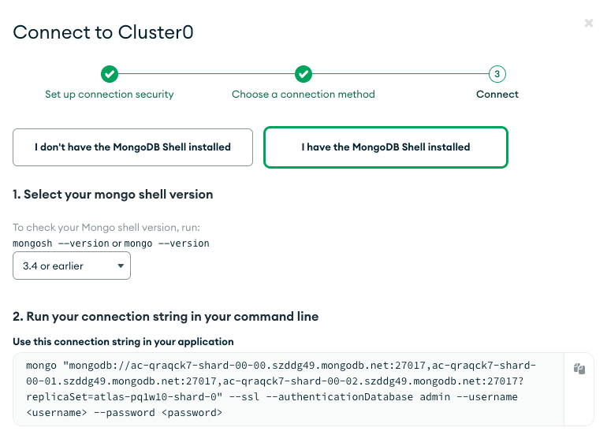

# Atlas - MongoDB


In this section, we will need to gather the following values:

* Connection string
* Username
* Password
* Authentication Database

Also, to allow Artie Transfer to read the change event stream, the MongoDB cluster must be running in a Replica Set. If you have any questions about how to set that up, get in touch with us at [hi@artie.so](mailto:hi@artie.so)!


## Connection string

To grab the connection string, follow these steps:

1. Go to [Atlas UI](https://cloud.mongodb.com/)
2. Find your deployment and click `Connect`
3. Click on shell and select `3.4 or earlier` for mongo shell

<figure><figcaption></figcaption></figure>

## Authentication

Please see the diagram below. To get here, go into your Atlas console, make sure you are on the right project and then select "Database Access".

<figure><figcaption></figcaption></figure>
